# EQL Parse

DPS parser for **EverQuest Legends**.

[Español](README.md) · **English**

[](https://github.com/infinityl111/eql-parse-spain/releases/latest)
[](https://paypal.me/eqcampeon)

Real-time combat parser for EverQuest Legends. It measures your damage, tells
you which stance suits what is hitting you, reads chat aloud, keeps every fight
you've had, and builds an encyclopedia of zones, enemies and loot from what
you've measured yourself and what the wiki says.

Interface in Spanish, English, French, German and Portuguese.

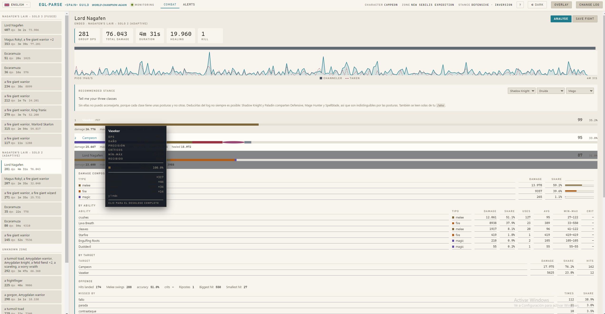

---

## If you just want to use it

1. Download the installer and run it.
2. Windows will say it doesn't recognise the app. That's normal for unsigned
   programs: **More info → Run anyway**.
3. In game, type `/log on`.
4. Options → Filters: set **everything damage-related to full detail**, yours
   and other people's. Without this the parser never sees your group's damage
   and the numbers come out wrong. It's the number one mistake.
5. Open the app. It finds your `eqlog_*.txt` on every drive and reads the whole
   log the first time.
6. Pick your three classes, or type `/who` and they're read for you.
7. If you use a pet, type `/pet who leader` once: in EQL it gets a new name
   every summon, and this way it stays identified for good.

### Shortcuts

| Shortcut | What it does |
| --- | --- |
| `Ctrl+Alt+M` | Show or hide the overlay |
| `Ctrl+Alt+O` | Toggle between clicks to the game and clicks to the overlay |
| `Ctrl+Alt+X` | Close the overlay |

The overlay needs EQL in **windowed or borderless**. And if the game stutters
while you use it, check **Options → Display → Max Background FPS**: on «Min CPU»
the game drops to a few frames whenever it loses focus.

---

## What it does

### Stance advice that's measured, not guessed

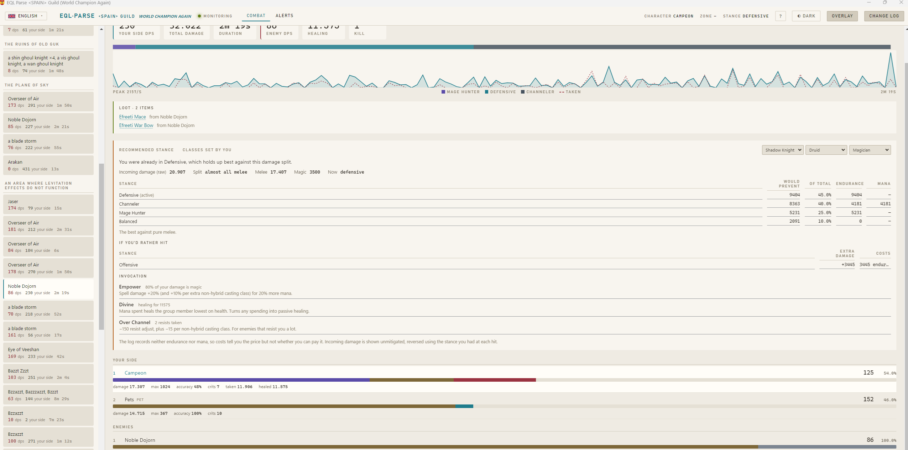

The log stores damage **already mitigated**: if you were in Defensive, the melee
you see is halved. Comparing stances against those numbers would always push you
toward whichever one you already had on. The program reverses the mitigation
using the stance active at each hit and compares raw damage instead.

Two thresholds fall out of the wiki's arithmetic that you can't eyeball:

- Channeler beats Defensive once magic damage exceeds half the melee.
- And it beats Mage Hunter once melee exceeds half the magic.

So Channeler isn't a timid middle ground: it's the correct pick across the whole
central band.

### Enemy dossier

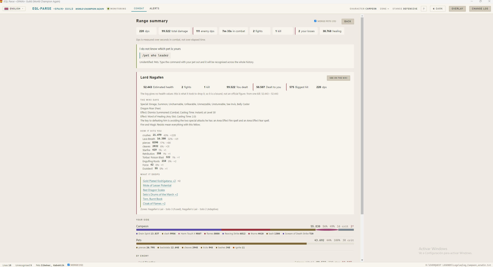

Pick an enemy and see everything known about it:

- **Estimated health**, derived from the damage it took to drop it. The log
  gives no health values, so it's a measured bound and it says so.
- **Which of your spells it resists**, split by invocation. The same spell can
  land 20% of the time under Inversion and 80% under Over Channel; the mean of
  the two describes neither. You'll know from your own numbers whether the
  −150 resist adjust is worth it against each mob.
- **How it hits you**: its abilities by damage, and its biggest hit.
- **What the wiki says**, pulled from eqlwiki.com. On Lord Nagafen: "Fire and
  Magic Resists mean everything with this fellow".
- **What it drops**, with a link to each item.

### Encyclopedia

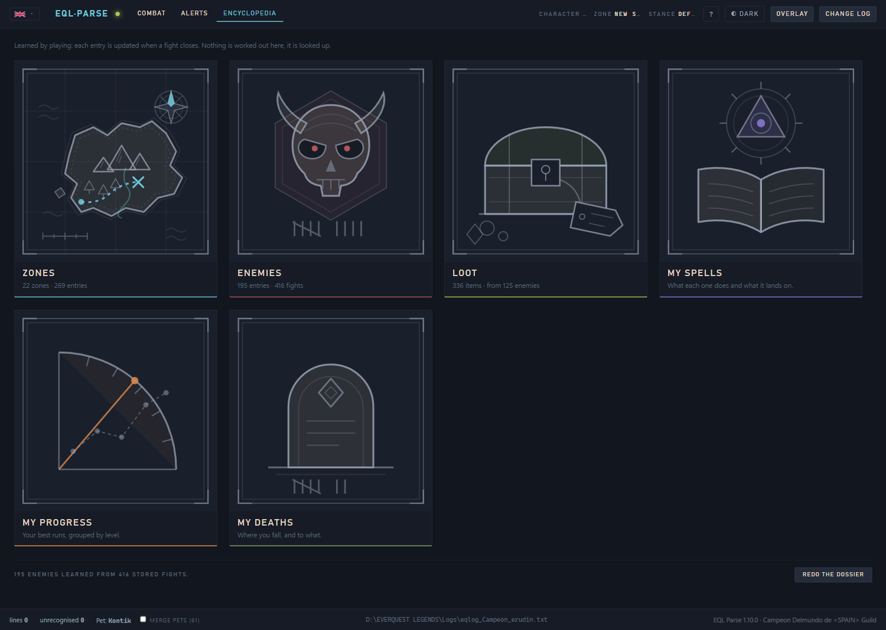

Everything you've learned by fighting, arranged so you can look it up later. One
rule governs the whole section: **nothing is computed when you open it**. Each
enemy's entry is brought up to date when a fight closes, which is when the data
is already in hand; looking it up is reading, not computing. With two thousand
stored fights, opening any of its screens costs two hundredths of a second.

#### Zones, and why everything is split by difficulty

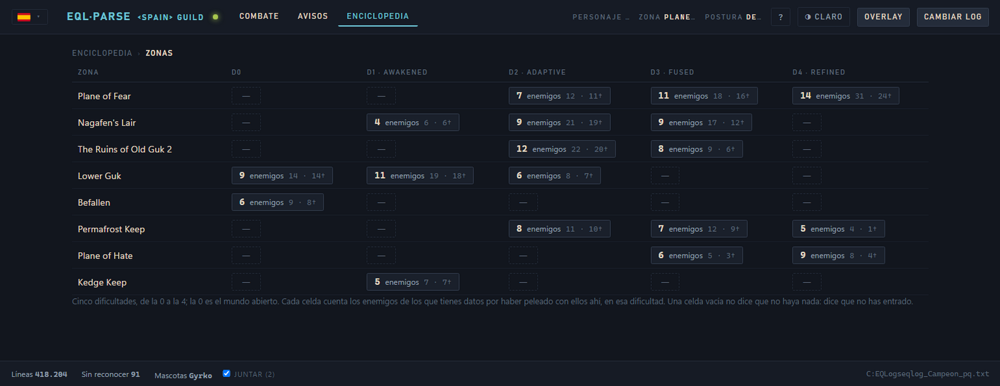

One row per zone, one column per difficulty, D0 to D4. This screen is the one
that explains at a glance why everything else is kept apart: the same zone at
D2, D3 and D4 is not the same zone. In EQL every instance rolls a difficulty and
the enemies genuinely change — measured on a real log, Magus Rokyl has **59%
more health at D3 than at D2**, hits 3.6 times harder, and casts two spells it
doesn't have at D2. Averaging them would describe an enemy that doesn't exist.

An empty cell is dashed and doesn't say there's nothing there: it says **you
haven't been in**. Those are two different things and they should look
different. D0 is the open world: the log never writes it — an un-instanced zone
doesn't say "- Solo 0", it says nothing — but "at what difficulty?" does have an
answer.

#### An enemy's file, and every fight you've had against it

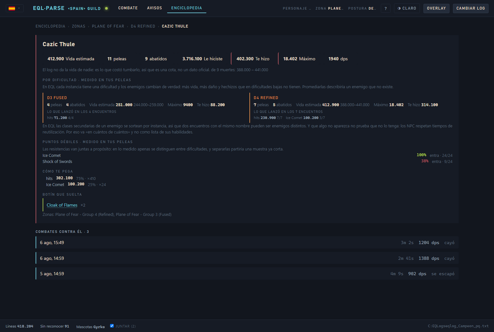

Opening an enemy gives you its full file — estimated health, one card per
difficulty, what it resists, what it hits you with, what the wiki says and what
it drops — and below it **every fight you've had against it** in that zone at
that difficulty. Click one and it opens in the Combat tab.

Estimated health is never averaged across difficulties: you get the one from the
highest difficulty where it actually fell, labelled as such. If it never fell at
the highest, the lower one is shown — claiming the higher one would be inventing
it.

#### Loot

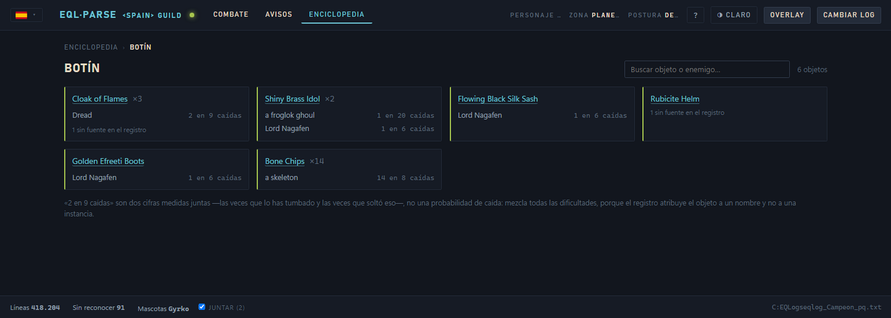

Every item, who dropped it and how many times: **"2 in 9 kills"**. That's two
measured figures side by side — the times you brought it down and the times it
dropped that — not a drop rate: it mixes every difficulty, because the log
attributes the item to a name and not to an instance. And whatever the log
attributes to nobody shows up anyway, saying it has no source: a list quietly
missing items is worse than one with declared gaps.

#### My spells, my deaths and my progress

Your spell catalogue — what each one does, what it lands on and how long it
takes to come back —, where you fall and to what, and your marks. Every spell
with its icon, and what isn't a spell carries none: `hits` has no icon because
it isn't a spell, not because something is missing.

Under deaths, the enemy shown beside each one is **the one that dealt you the
most damage in that fight**, not the one that landed the killing blow: the log
never says which it was.

Every spell opens its own dossier: which brackets it hits in, how often it
crits, the two numbers it lives between, and what you have landed it on. Marks
are grouped by level and they open: the best fight of each one is a click, not a
loose number.

And under progress there is **no dps-over-time curve**, on purpose: it rises
when you level and falls when you fight something tougher, so it measures both
at once and neither. What compares is the same enemy, at the same difficulty, at
the same level, and a line is only drawn once that triple reaches five fights.
Three points are not a trend: they are three points.

**Nor is it a progression — they are periods.** In EQL swapping a class for a
lower one LOWERS your level: over a real history, three of ten changes are drops.
So the line goes up and down, and the only thing compared is periods at the same
level. Beside them sit the dated milestones — ability points and gear with its
`+N` — placed NEXT TO the figures and never as a cause: that you gained ten
points and that your record went up are two facts; saying one explains the other
is something else.

#### Your spellbook

The table above measures what you cast; this measures the opposite. A spell that
shows up nowhere might be one you do not own or one you own and never bring out,
and those are very different things. The log can tell them apart because
scribing, memorizing and buying each leave a line, and every spell is shown with
where it is known from: *scribed* means it is in your book, *bought* means you
paid for it, *memorized* only means you had it slotted once, and that could have
been twenty levels ago.

It comes from the log and **there is no file to export**. Over a real history
that is 84 spells and 40 that never come out. The ones cast with no record of
where they came from are shown separately rather than hidden: they predate the
log, or belong to an earlier class.

#### The entries are learned, not computed

They live next to your history and carry three marks that detect three different
things: their own generation, the generation of the store they were built from,
and the last fight folded in. If they're only missing the fights from while the
app was closed, those get folded in at startup; if you rebuilt the history, it
notices and they're rebuilt whole. There's a button at the foot of the section
and the `npm run enc:rebuild` command, which also compares the rebuilt entries
against the previous ones and warns you if any figure moved. Rebuilding never
re-reads your log: it walks the history you already have.

### Range summary

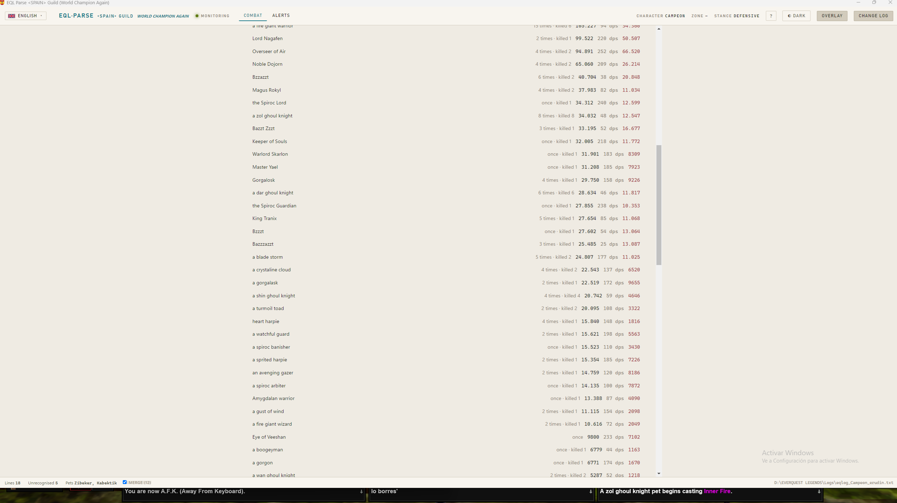

Every fight from the last 2 h, 12 h, 24 h, 3 days, week or month in one
breakdown. Each combatant expands with abilities summed, by damage type, by
target, and who hit them. Dps is measured over seconds in combat, not over
elapsed time.

Fights are saved to disk, so they're there the moment you open the app without
re-reading the log.

### Post-fight analysis

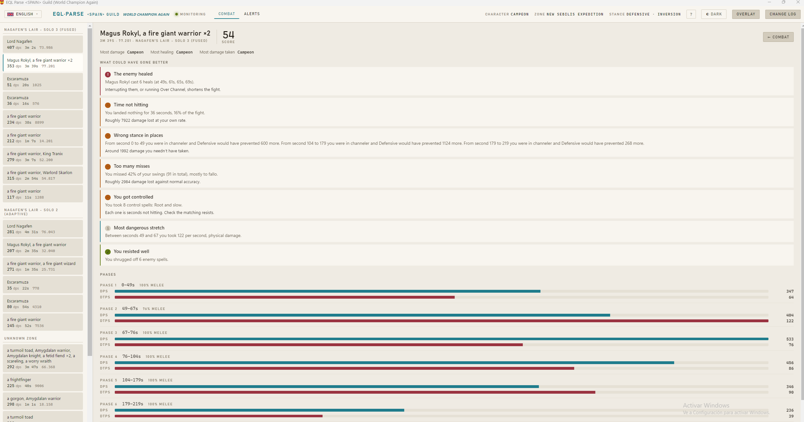

It cuts the fight into phases by what happens, not by the clock: when the
incoming damage composition flips, when you stop hitting, when a spike lands, or
when the boss summons. Then it flags eleven concrete things, each with its
impact quantified: downtime, wrong stance per window, accuracy, enemy heals,
control taken, interrupts, resists, wasted healing, focus, deaths, and burst
versus sustain.

### Overlay

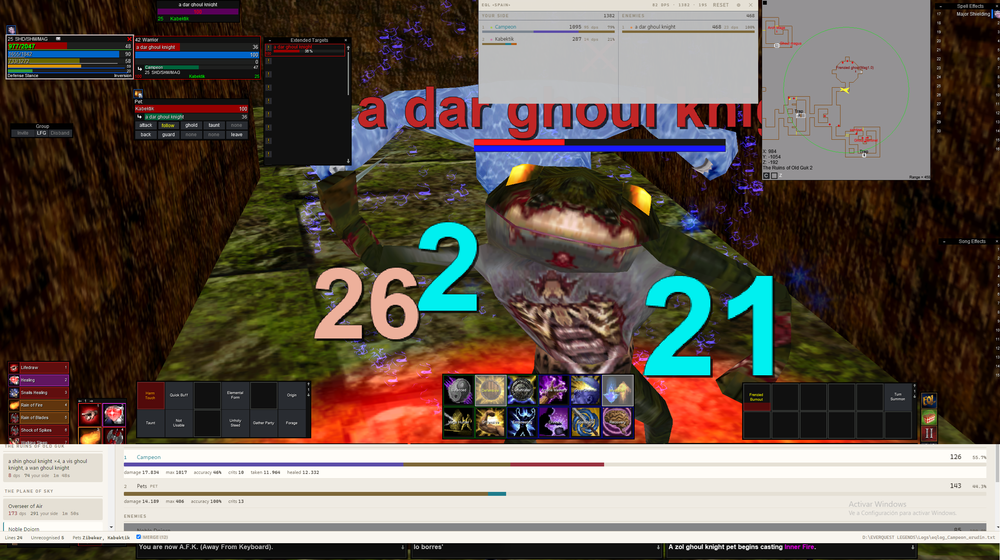

Two columns, your side and the enemies. Damage accumulates across the whole
session and only resets when you want it to. Rows expand on click, dead enemies
sink to the bottom, and when one drops a card shows for a few seconds who dealt
how much to it.

### Loot with item tooltips

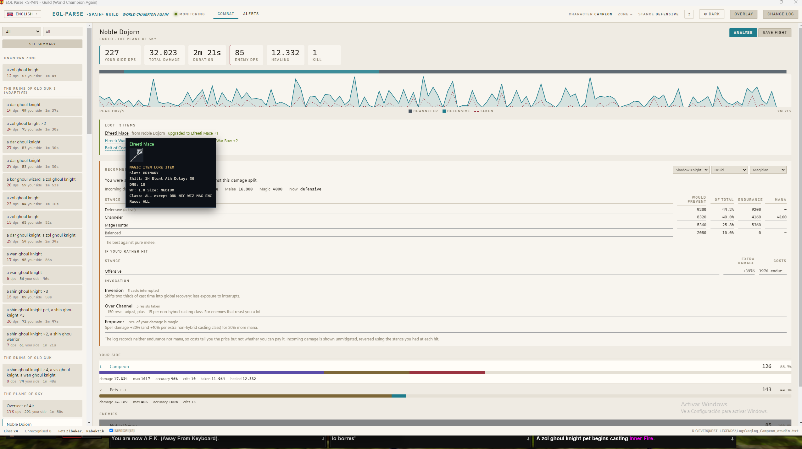

Every fight records what dropped, telling apart what you picked up, what
auto-sold and what became an upgrade. Hovering shows the stat block in the
game's own style, pulled from the wiki; clicking opens its page.

### Level and classes: three sources, and an order between them

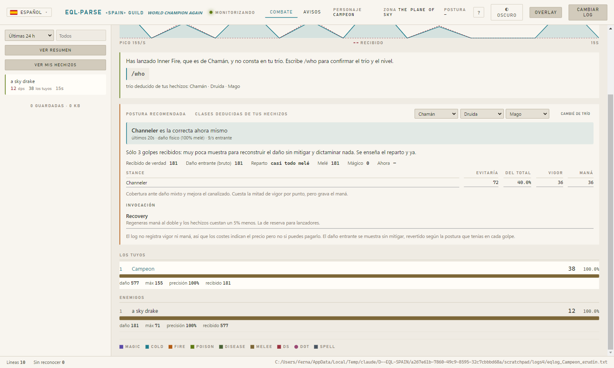

In EQL you can change your class trio, and the log **says so nowhere**. Since
your effective level is that of your lowest class, a trio change can drop it
from 50 to 24 without leaving a trace. Without solving this, comparing today's
DPS against yesterday's means nothing.

It is solved with three sources, and the label always says which one won:

1. **What you declare by hand** — you were there and the log was not.
2. **The `/who`** — true, but only of the instant you type it.
3. **An exclusive spell** — proves that class was active. Never the level.

If you cast a spell that only one class can cast and that class is not in your
trio, the notice above appears with the spell and class named, and asks for a
`/who`. The trio corrects itself; the level is **cleared**, because no spell
proves a level. A spell shared by two classes proves nothing and stays quiet.

### The trio table

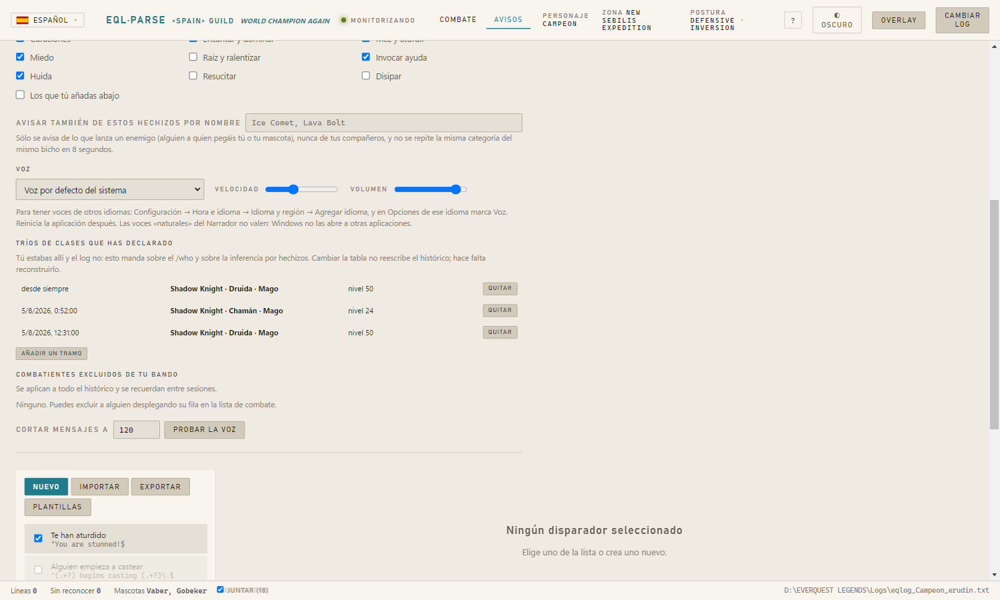

Your word beats the other two, including a later `/who`: that `/who` describes
a later moment, not yours. The **"Changed trio"** button sits next to your
classes, not buried in settings, because it is the gesture you will use 90% of
the time. For past stretches, the full table with date, trio and level.

The row's level is optional on purpose: leave it empty while you are levelling
and the log's level-ups will rule inside that stretch.

And because manual entries take priority, below the table you get **every time
your table and the log disagree**. Nothing is corrected: it is shown, because
if you get a date wrong there is nothing else to warn you.

### Who is on your side

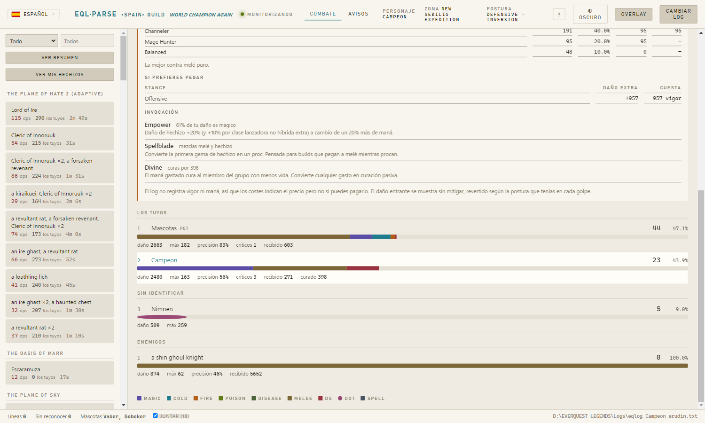

The EQL log does not say who is in your group: no invites, no joins, no
leaves. So someone hitting your enemies is indistinguishable from a groupmate
by any data.

What can be asserted, is: **whoever heals an enemy is an enemy**, and the rule
propagates to whoever heals the healer. The rest — players who did real damage
but for whom there is not a single `/who` — goes in its own **"Unidentified"**
section, neither deleted nor added to your side. With a "Not one of mine"
button for the ones you know, remembered between sessions.

In EQL your pet also gets a new name on every summon. When a new unidentified
one shows up, you are asked for a `/pet who leader` once per name and session,
with a checkbox to turn it off.

### Voice and alerts

Reads incoming chat with a checkbox per channel and narrates combat:
recommended stance change, your death, your pet's, adds joining, a summary when
the fight ends. It also calls out enemy casts that change the fight — heals,
charm, mez, fear, root — enemies only and without repeating itself.

Plus a regex trigger editor, GINA style, with timers and live testing.

---

## If you want to work on it

```
npm install
npm start              # development
npm run dist           # installer in dist/
npm test               # 381 engine checks
npm run calibrate -- "path\to\eqlog.txt" --self YourChar
npm run store:check    # inspects the history without writing anything
npm run store:rebuild  # rebuilds it by re-reading the log
```

```
src/tailer.js      incremental log reading
src/patterns.js    pattern dictionary, calibrated against real logs
src/parser.js      line -> normalised event
src/encounter.js   fight segmentation and aggregation
src/store.js       fight store: append-only, never rewritten
src/rebuild.js     history rebuild by re-reading the log
src/aggregate.js   summing many fights, and the enemy dossier
src/stances.js     stance and invocation data for all 16 classes
src/classes.js     each class's exclusive spells, from the wiki
src/trios.js       the trio table you declare by hand
src/zones.js       zone, sub-zone and instance difficulty
src/advisor.js     which stance suits, on damage reversed to raw
src/analysis.js    post-fight analysis of long fights
src/wiki.js        item tooltips and tactical notes from eqlwiki.com
src/spells.js      spell classification by category
src/narrator.js    voice: chat and combat
src/triggers.js    regex triggers
src/i18n.js        translations
src/engine.js      the facade that ties it together
electron/          windows, IPC, configuration
ui/                interface, no build step
```

`npm run calibrate` walks a log and lists the lines the parser does **not**
recognise, ordered by frequency. It's the tool for extending the dictionary when
EQL changes wording or adds spells.

---

## What it cannot know

The EverQuest log records nobody's health, endurance, mana or position. That's
where the program's limits come from, and none of them are papered over:

- Each stance's cost tells you the price, **not whether you can pay it**.
- The analysis will never say a heal came late: there's no health data.
- Only **your** stance is known; nobody else's appears in the log.
- **It does not say who is in your group.** Hence a separate section for those
  who hit your enemies without any evidence they are yours, and a button for
  you to settle it.
- **It does not say when you change class trio, nor what level that leaves
  you at.** It is deduced from the exclusive spells you cast, which prove the
  class but never the level. For the level you need your own `/who` or the
  manual table.
- An enemy's health is an estimate from the damage it took to kill it, not an
  official figure.
- Timestamps have one-second resolution, so on short fights DPS carries a large
  structural error. It uses the GamParse/ACT convention,
  `total / (last − first + 1)`.
- Shield damage without a possessive (`shards of ice`) can't be attributed, so
  it's kept separate rather than pinned on someone.
- While an evasion stance is active there's no way to know how much damage
  would come in without it: the log doesn't distinguish a stance evade from an
  ordinary parry, and what you see is only the 5% of attacks that got through.
  There the split is shown, but nothing is recommended.

---

## Support

Personal project, free to use. If you find it useful and feel like buying a
coffee, [here's the link](https://paypal.me/eqcampeon). No obligation.

---

Made by **Campeon Delmundo** of &lt;SPAIN&gt; Guild, while playing. Everything it
measures came out of a real character, and most of the odd decisions you will
find in the code are there because something did not add up in that log.
